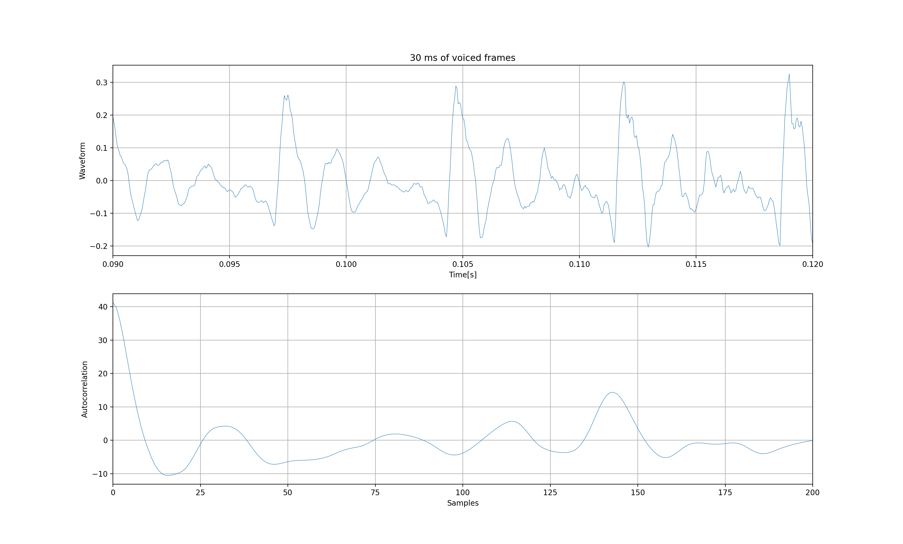
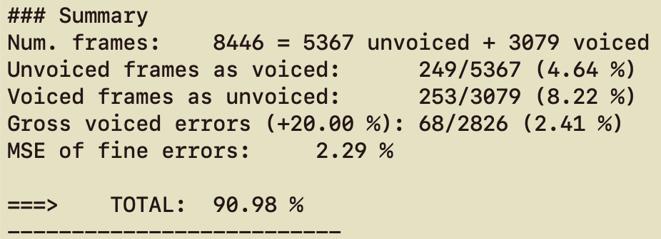

PAV - P3: detección de pitch
============================

Esta práctica se distribuye a través del repositorio GitHub [Práctica 3](https://github.com/albino-pav/P3).
Siga las instrucciones de la [Práctica 2](https://github.com/albino-pav/P2) para realizar un `fork` de la
misma y distribuir copias locales (*clones*) del mismo a los distintos integrantes del grupo de prácticas.

Recuerde realizar el *pull request* al repositorio original una vez completada la práctica.

Ejercicios básicos
------------------

- Complete el código de los ficheros necesarios para realizar la detección de pitch usando el programa
  `get_pitch`.

   * Complete el cálculo de la autocorrelación e inserte a continuación el código correspondiente.

    ```c
    for (unsigned int m = 0; m < r.size(); ++m) {
  		/// \TODO Compute the autocorrelation r[l]
      /// \DONE Autocorrelation computed
      r[m] = 0;
      for(unsigned int n = 0; n < x.size()-m; ++n){
        r[m]+= x[n]*x[n+m];
      }
      r[m] /= x.size();
    }
    ```    

   * Inserte una gŕafica donde, en un *subplot*, se vea con claridad la señal temporal de un segmento de
     unos 30 ms de un fonema sonoro y su periodo de pitch; y, en otro *subplot*, se vea con claridad la
	 autocorrelación de la señal y la posición del primer máximo secundario.

    > Se escoge la 6a trama del fichero 'rl001.wav' para visualizar parte de un fonema sonoro [0.09s,0.012s].
    >
    > 
    > 
    > Estimamos que el periodo de pitch son 0.007 segundos.
    >
    > Como se puede observar, la señal tiene el primer máximo secundario aproximadamente en el valor 143. Coincide con inverso del periodo de pitch.
    >
    > 

	 NOTA: es más que probable que tenga que usar Python, Octave/MATLAB u otro programa semejante para
	 hacerlo. Se valorará la utilización de la librería matplotlib de Python.

    ```c
    import numpy as np
    import soundfile as sf
    import matplotlib.pyplot as plt
    import scipy.signal as sig
    arxiu='/Users/sergi24sanchez/PAV/P3/pitch_db/train/rl001.wav'
    x,fm=sf.read(arxiu)

    #Time vector
    samples = []
    for i in range(0,len(x)):
    samples.append(i/fm)

    #Autocorrelation
    autocorrelation=np.correlate(x,x,"same")
    m = np.arange(len(autocorrelation))
    peaks = sig.find_peaks(autocorrelation)
    [a1,a2]=np.split(autocorrelation,2)

    #Plot generation
    plt.subplot(2,1,1)
    plt.plot(samples,x,lineWidth=0.5)
    plt.title('30 ms of voiced frames')
    plt.grid(True)
    plt.xlabel('Time[s]')
    plt.ylabel('Waveform')
    plt.xlim(0.09,0.12) #6a trama
    plt.subplot(2,1,2)
    plt.plot(a2,lineWidth=0.5)
    plt.xlabel('Samples')
    plt.ylabel('Autocorrelation')
    plt.xlim(0,200)
    plt.grid(True)  
    ```

   * Determine el mejor candidato para el periodo de pitch localizando el primer máximo secundario de la
     autocorrelación. Inserte a continuación el código correspondiente.

  ```c
  float PitchAnalyzer::compute_pitch(vector<float> & x) const {
    if (x.size() != frameLen)
      return -1.0F;

    //Window input frame
    for (unsigned int i=0; i<x.size(); ++i)
      x[i] *= window[i];

    vector<float> r(npitch_max);

    //Compute correlation
    autocorrelation(x, r);

    //vector<float>::const_iterator iR = r.begin(), 
    vector<float>::const_iterator iRMax = r.begin() + npitch_min;

    for(vector<float>::const_iterator iR = iRMax; iR < r.end(); iR++){
      if(*iR > *iRMax){
        iRMax = iR;
      }
    }
    unsigned int lag = iRMax - r.begin();

    float pot = 10 * log10(r[0]);
  }
  ```
  > Se pretende encontrar el máximo de la autocorrelacion entre el rango de valores [npitch_min,npitch_max].
  > Se implementa usando iteradores, donde el iterador iRMax se queda con el índice del valor máximo dentro del rango especificado.

   * Implemente la regla de decisión sonoro o sordo e inserte el código correspondiente.

  ```c
  bool PitchAnalyzer::unvoiced(float pot, float r1norm, float rmaxnorm) const {
    float score = 0;
    const float potvalue = potvalue_th, r1value = r1norm_th, rmaxvalue = rmaxnorm_th;

    if(pot < potvalue)
      score += 0.5;
    else if (r1norm < r1value)
      score += 0.5;
    else if (rmaxnorm < rmaxvalue)
      score += 0.5;
    if (score >= 0.5)
      return true;
    else
      return false;
  }
  ```
  > La regla de decisión de una trama sorda, se decide con 3 umbrales correspondientes a la energia de la trama (pot_value), la autocorrelacion en 1 normalizada (r1_value) y autocorrelación en el máximo encontrado normalizada (rmax_value).
  >
  > Se decide que una trama es sorda cuando se cumple cualquiera de estos umbrales.
  >
  > Lo hemos decidido de esta forma ya que hemos observado lo siguiente: cuando la potencia baja de un cierto umbral es un buen indicador de que esa trama es silencio; cuando la autocorrelacion en 1 es muy diferente de la energía de la trama (r[0]), nos ayuda a detectar sonidos sordos; y cuando la rmax normalizada está por debajo de un cierto umbral es que no está marcada claramente la periocidad predominante.

- Una vez completados los puntos anteriores, dispondrá de una primera versión del detector de pitch. El 
  resto del trabajo consiste, básicamente, en obtener las mejores prestaciones posibles con él.

  * Utilice el programa `wavesurfer` para analizar las condiciones apropiadas para determinar si un
    segmento es sonoro o sordo. 
	
	  - Inserte una gráfica con la detección de pitch incorporada a `wavesurfer` y, junto a ella, los 
	    principales candidatos para determinar la sonoridad de la voz: el nivel de potencia de la señal
		(r[0]), la autocorrelación normalizada de uno (r1norm = r[1] / r[0]) y el valor de la
		autocorrelación en su máximo secundario (rmaxnorm = r[lag] / r[0]).

    > Se visualiza rmaxnorm (arriba), r1norm (centro) y la potencia de la señal (abajo):
    > 
    >
    > Visualización de la detección del pitch:
    > 


	Puede considerar, también, la conveniencia de usar la tasa de cruces por cero.

	  Recuerde configurar los paneles de datos para que el desplazamiento de ventana sea el adecuado, que
		en esta práctica es de 15 ms.

      - Use el detector de pitch implementado en el programa `wavesurfer` en una señal de prueba y compare
	    su resultado con el obtenido por la mejor versión de su propio sistema.  Inserte una gráfica
		ilustrativa del resultado de ambos detectores.

    > Visualización de la detección del pitch de Wavesurfer (arriba) y nuestra implementación (abajo):
    > 

  
  * Optimice los parámetros de su sistema de detección de pitch e inserte una tabla con las tasas de error
    y el *score* TOTAL proporcionados por `pitch_evaluate` en la evaluación de la base de datos 
	`pitch_db/train`..

  > Los valores de los umbrales que funcionan mejor para la detección de las tramas sordas son:
  >
  > Potencia inferior a -49 dB.
  >
  > Autocorrelacion en 1 normalizada (r1norm) inferior a 0.84.
  >
  > Autocorrelacion en el primer máximo normalizada inferior (rmaxnorm) a 0.29.

  > Con los parámetros optimizados, y sin ningún preprocesado ni postprocedado, nuestro sistema de detección de pitch tiene una puntuación de 90.98%
  > 

   * Inserte una gráfica en la que se vea con claridad el resultado de su detector de pitch junto al del
     detector de Wavesurfer. Aunque puede usarse Wavesurfer para obtener la representación, se valorará
	 el uso de alternativas de mayor calidad (particularmente Python).

   > 
   >
   > A continuación se muestra el código de Python empleado para la representación:
   >
    ```c
    import numpy as np
    import matplotlib.pyplot as plt
    arxiu1='rl001_wavesurfer.txt'
    arxiu2='/Users/sergi24sanchez/PAV/P3/pitch_db/train/rl001.f0' 

    wavesurfer = np.loadtxt(arxiu1,skiprows=0)
    estimacion = np.loadtxt(arxiu2,skiprows=0)

    dm = 0.015
    #Time vector
    samples = []
    for i in range(0,len(estimacion)):
        samples.append(i*dm)


    plt.plot(samples,estimacion,'g',lineWidth=1,label='Pitch detector')
    plt.plot(samples,wavesurfer,'r',lineWidth=1.5,label='Wavesurfer pitch detector')
    plt.title('Estimacio de Pitch')
    plt.xlabel('Time[s]')
    plt.ylabel('Frequency[Hz]')
    plt.xlim(0,1.24)
    plt.legend(loc='upper right')
    ```
   

Ejercicios de ampliación
------------------------

- Usando la librería `docopt_cpp`, modifique el fichero `get_pitch.cpp` para incorporar los parámetros del
  detector a los argumentos de la línea de comandos.
  
  Esta técnica le resultará especialmente útil para optimizar los parámetros del detector. Recuerde que
  una parte importante de la evaluación recaerá en el resultado obtenido en la detección de pitch en la
  base de datos.

  * Inserte un *pantallazo* en el que se vea el mensaje de ayuda del programa y un ejemplo de utilización
    con los argumentos añadidos.
  > Se han incorporado los 3 parámetros que gobiernan la decisión voiced/unvoiced
  > 
  >
  > Un ejemplo de utilización:
  > 
- Implemente las técnicas que considere oportunas para optimizar las prestaciones del sistema de detección
  de pitch.

  Entre las posibles mejoras, puede escoger una o más de las siguientes:

  * Técnicas de preprocesado: filtrado paso bajo, *center clipping*, etc.
  > Se ha implementado center clipping sin offset y filtro paso bajo con frecuencia de corte de 2000 Hz
  ```c
  // Center-Clipping
  for (unsigned int i = 0; i < x.size(); i++){
    if(abs(x[i]) / max_value < 0.009) // Valor optimitzat
      x[i] = 0.0F;
  }
  ```

  * Técnicas de postprocesado: filtro de mediana, *dynamic time warping*, etc.
  * Métodos alternativos a la autocorrelación: procesado cepstral, *average magnitude difference function*
    (AMDF), etc.
  * Optimización **demostrable** de los parámetros que gobiernan el detector, en concreto, de los que
    gobiernan la decisión sonoro/sordo.
  * Cualquier otra técnica que se le pueda ocurrir o encuentre en la literatura.

  Encontrará más información acerca de estas técnicas en las [Transparencias del Curso](https://atenea.upc.edu/pluginfile.php/2908770/mod_resource/content/3/2b_PS%20Techniques.pdf)
  y en [Spoken Language Processing](https://discovery.upc.edu/iii/encore/record/C__Rb1233593?lang=cat).
  También encontrará más información en los anexos del enunciado de esta práctica.

  Incluya, a continuación, una explicación de las técnicas incorporadas al detector. Se valorará la
  inclusión de gráficas, tablas, código o cualquier otra cosa que ayude a comprender el trabajo realizado.

  También se valorará la realización de un estudio de los parámetros involucrados. Por ejemplo, si se opta
  por implementar el filtro de mediana, se valorará el análisis de los resultados obtenidos en función de
  la longitud del filtro.
   

Evaluación *ciega* del detector
-------------------------------

Antes de realizar el *pull request* debe asegurarse de que su repositorio contiene los ficheros necesarios
para compilar los programas correctamente ejecutando `make release`.

Con los ejecutables construidos de esta manera, los profesores de la asignatura procederán a evaluar el
detector con la parte de test de la base de datos (desconocida para los alumnos). Una parte importante de
la nota de la práctica recaerá en el resultado de esta evaluación.
